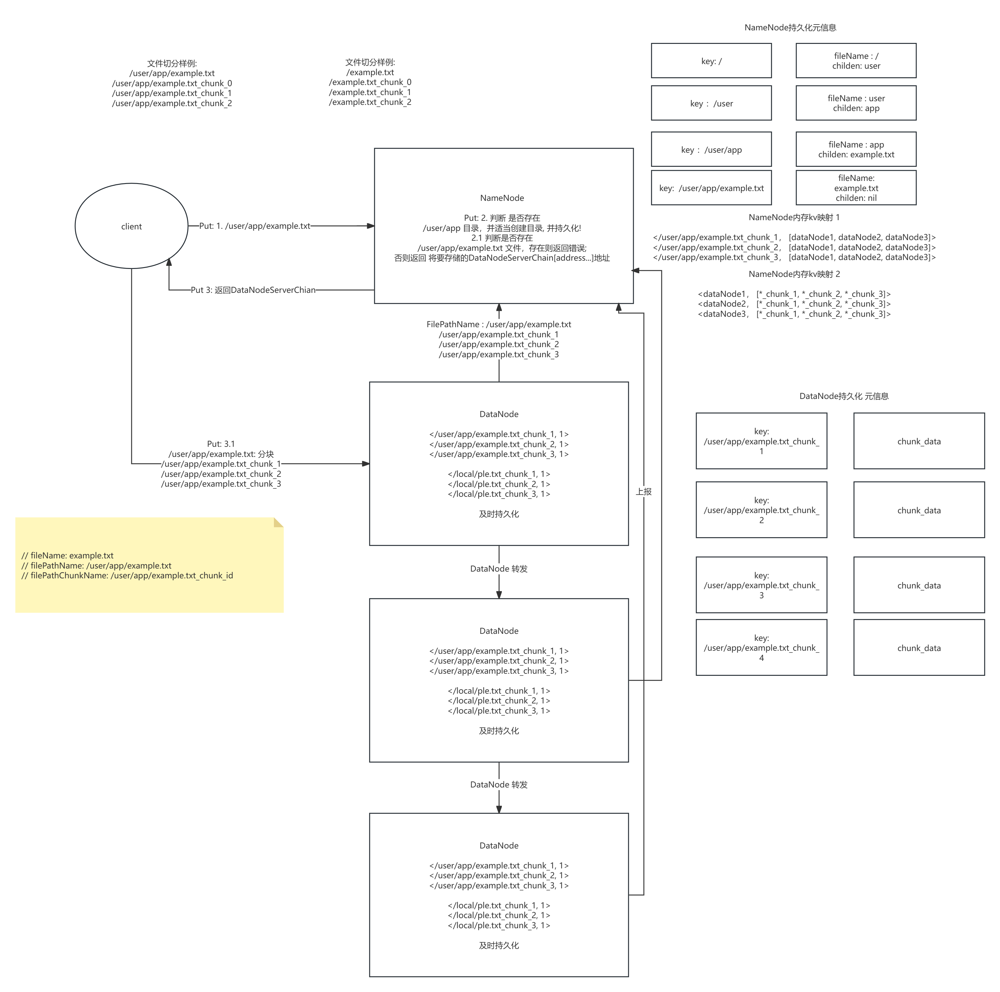

# TrainFS

A distributed file system designed with reference to HDFS architecture, supporting basic operations such as file read/write/delete and directory management. Metadata is stored in NameNode, files are split into blocks and stored across multiple DataNodes with multi-replica redundancy.

## Quick Start

### 1. Start NameNode

**Option A: IDE Debug**
```bash
# In GoLand, set Run Kind to Package
# Program Arguments:
-conf=nameNode/conf/nameNode_config.yml
```

**Option B: Run from Source**
```bash
cd TrainFS/nameNode
go run nameNode_ctrl.go -conf=./conf/nameNode_config.yml
```

**Option C: Build and Run**
```bash
cd TrainFS/nameNode
go build -o ./build/nameNode
./build/nameNode
```

### 2. Start DataNode (Multiple Nodes)

**Option A: IDE Debug**
```bash
# Program Arguments:
-id=1 -port=9001 -conf=dataNode/conf/dataNode_config.yml
```

**Option B: Run from Source**
```bash
cd TrainFS/dataNode
go run dataNode_ctrl.go -id=1 -port=9001 -conf=./conf/dataNode_config.yml
go run dataNode_ctrl.go -id=2 -port=9002 -conf=./conf/dataNode_config.yml
go run dataNode_ctrl.go -id=3 -port=9003 -conf=./conf/dataNode_config.yml
```

**Option C: Build and Run**
```bash
cd TrainFS/dataNode
go build -o ./build/dataNode
./build/dataNode -id=1 -port=9001
./build/dataNode -id=2 -port=9002
./build/dataNode -id=3 -port=9003
```

### 3. Client Testing

```bash
cd TrainFS/client
go test -run TestPutFile
go test -run TestGetFile
go test -run TestDelete
```

### 4. Regenerate Protobuf (Optional)

```bash
go get -u google.golang.org/protobuf/proto@latest
go get -u google.golang.org/protobuf/protoc-gen-go@latest
go get -u google.golang.org/grpc/protoc-gen-go-grpc@latest

cd profile
protoc --go_out=. --go-grpc_out=. ./*.proto
```

---

## System Architecture



---

## API Reference

### PutFile(localFilePath, remotePath)
Upload a local file to the distributed file system.

```go
PutFile("/home/user/test.txt", "/app")
```

**Flow**:
1. Client requests upload from NameNode, gets DataNode address chain
2. File is split into multiple Chunks by configured size (e.g., `test.txt_chunk_0`, `test.txt_chunk_1`)
3. Client sends Chunks to the first DataNode, nodes forward in chain
4. DataNode saves data and commits metadata to NameNode
5. Client confirms upload completion

### GetFile(remoteFilePath, localPath)
Download a file from the distributed file system to local.

```go
GetFile("/app/test.txt", "/home/user")
```

**Flow**: Query NameNode for block locations, retrieve Chunks from DataNodes and merge.

### Mkdir(remoteDirPath)
Create a remote directory.

```go
Mkdir("/home/user")
```

### DeleteFile(remotePath)
Delete a file or empty directory.

```go
DeleteFile("/home/user/test.txt")
DeleteFile("/home/user")  // Only supports empty directories
```

**Flow**: NameNode deletes metadata, sends delete tasks to DataNodes via heartbeat.

### ListDir(remoteDirPath)
List directory contents.

```go
ListDir("/home/user")
```

### ReName(oldPath, newPath)
Rename an empty directory.

```go
ReName("/home/user", "/home/newUser")
```

---

## Core Components

### NameNode (Metadata Center)

Manages file system metadata, maintaining two core mappings:
- `<FilePath, [Chunk1, Chunk2, ...]>` - File to blocks mapping
- `<ChunkName, [DataNode1, DataNode2, ...]>` - Block to replica locations mapping

**Responsibilities**:
1. Receive DataNode registration and heartbeat, manage node status
2. Process block commits, update metadata mappings
3. Detect node failures, trigger replica rebalancing tasks
4. Dispatch delete/replication tasks via heartbeat responses

### DataNode (Data Node)

Handles actual data block storage and transfer.

**Responsibilities**:
1. Register with NameNode on startup, report disk space
2. Report all stored Chunk information
3. Send periodic heartbeats, execute dispatched tasks
4. Receive and store Chunks, forward to downstream nodes in chain

---

## Future Plans

1. **Optimize Metadata Structure**: Refine lock granularity, better support for ReName operations
2. **NameNode High Availability**: Upgrade to sharded distributed cluster based on consensus algorithm
3. **Async Commit Optimization**: DataNode receives and forwards data first, then batch commits to NameNode
